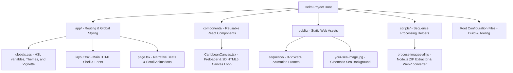
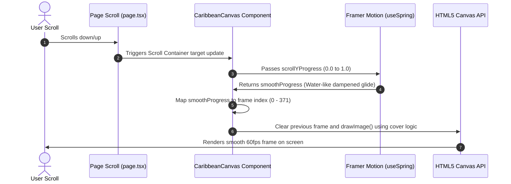

# HELM Website Structure & Architectural Guide

Welcome to the **Helm Website** documentation. This guide explains how the directories, files, and core systems work together to deliver a premium, high-performance scrollytelling experience.

---

## 1. Directory & File Map

Here is the brainstorming layout of the codebase. Each part of the directory structure is organized logically to separate application routing, interactive layout components, static assets, and dev scripts.



### Detailed Breakdown of Folders & Files

| Folder/File Path | Purpose | What it does |
| :--- | :--- | :--- |
| **`app/`** | **Application Router** | The root Next.js folder that holds page files, routing rules, and stylesheets. |
| ├── `app/page.tsx` | Main Page Logic | Core content file containing the scrollytelling steps. It hooks scroll positions to opacity transforms for text fades (Beat A and Beat B) and structures the sections. |
| ├── `app/globals.css` | Global Styling & Themes | Defines Tailwind base setups, local fonts, and standard CSS variables for the two themes (**Obsidian** vs **Dark**). It also contains the premium 4-border linear + radial vignette styling. |
| ├── `app/layout.tsx` | Site Wrapper | Creates the standard HTML `<html>` and `<body>` tags and wraps all pages with consistent fonts and settings. |
| ├── `app/favicon.ico` | Favicon | Browser tab icon. |
| **`components/`** | **React Components** | Home for interactive custom modules. |
| └── `components/CaribbeanCanvas.tsx` | Centerpiece Animator | The engine of the site. It preloads the 372 WebP animation frames, renders the custom percentage loader, and draws frames to a fullscreen HTML5 `<canvas>` based on scroll progress. |
| **`public/`** | **Static Web Assets** | Files served directly to the browser (images, animation frames). |
| ├── `public/sequence/` | WebP Frame Cache | Holds `frame_0.webp` to `frame_371.webp` images which make up the centerpiece rotation animation. |
| └── `public/your-sea-image.jpg` | Background Image | A moody coastal image utilized in the Dark Theme background to create depth under the animation canvas. |
| **`scripts/`** | **Developer Scripts** | Node scripts to manage and automate local asset pipelines. |
| └── `scripts/process-images-all.js` | Image Pipeline | Unzips raw frame exports (`ezgif-*.zip`) and compiles/converts them into compressed WebP assets inside `public/sequence/` using the `sharp` library. |
| **Root Configurations** | **System Tooling** | Project files like `tailwind.config.ts`, `package.json`, `tsconfig.json` etc., which setup TypeScript, build rules, and style compilers. |

---

## 2. Core Systems & How They Work

### System A: The Scrollytelling Canvas Loop

The main feature of the site is the scroll-driven steering helm. Instead of loading a heavy 3D model, the website uses a high-performance 2D Canvas sequence containing 372 WebP frames. Here is the operational flow of how a user scroll updates the canvas:



### System B: The Preloader & Asset Pipeline

Because loading 372 images takes bandwidth, the site uses an interactive progress loader screen:
1. **Preloading**: Inside `CaribbeanCanvas.tsx`, a React `useEffect` loops through frame paths and loads each image in memory using standard `new Image()`.
2. **Progress Calculation**: As each image loads, the percentage is updated: `Math.floor((loadedCount / totalFrames) * 100)`.
3. **Fade Out**: Once all 372 frames are loaded in memory, the preloader fades out using Framer Motion's `<AnimatePresence>`, revealing the animated site smoothly.

### System C: Dynamic Theme System

The site features a toggle switch between two cinematic styling presets:

```
[Obsidian Theme (Light)]  <======== Toggle Switch ========>  [Cinematic Dark Theme]
- Pure `#030712` deep background                            - Deep `#0B131F` background
- Centered Canvas blended with background                   - Sea backdrop + Twilight overlay blend
- Crisp white text cards                                    - Subtle 4-Border Vignette overlay active
```

The switch changes the class on the `<main>` tag between `theme-obsidian` and `theme-dark`. The variables in `globals.css` instantly transition key color values (e.g., backgrounds, borders, card opacity) over 500ms for a luxurious feel.

---

## 3. Quick Run & Build Command Cheat Sheet

To work with these files locally, you can run the following commands in your terminal:

*   **Launch Development Server**
    Runs the site locally on port 3000 with hot reloading:
    ```bash
    npm run dev
    ```
*   **Compile Production Build**
    Checks TypeScript correctness, compiles CSS, minifies JS, and generates static production pages:
    ```bash
    npm run build
    ```
*   **Generate Static Output Preview**
    Launches the compiled production pages to test speed:
    ```bash
    npm run start
    ```
